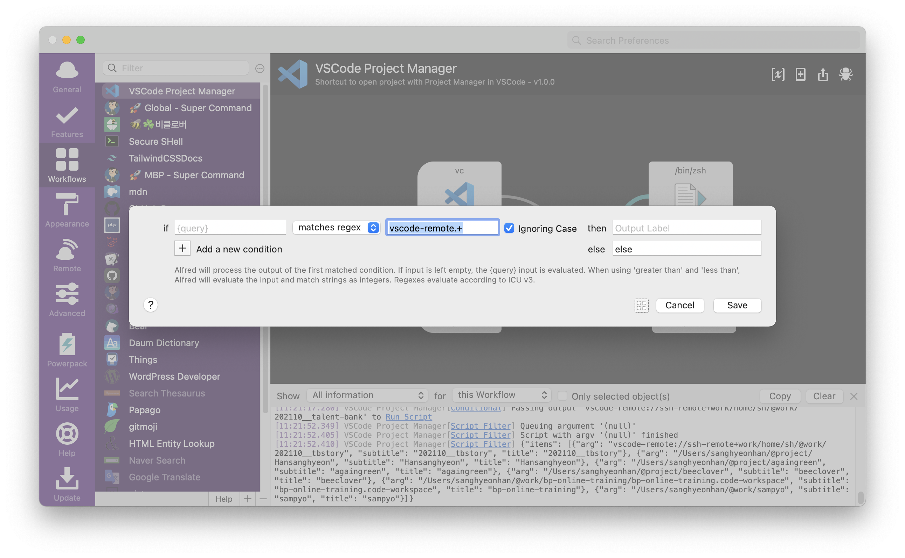
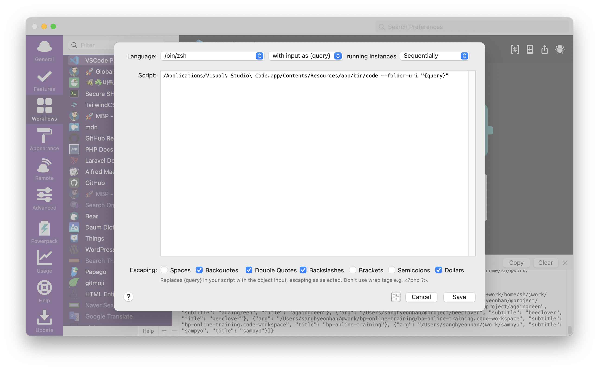

vscode의 Project manager 확장프로그램을 사용하고있다면 당신의 프로젝트 접근에 날개를 달아 줄 겁니다.

[kbshl/alfred-vscode: Alfred 3 workflow that allows you to browse and open Visual Studio Code projects or simply open specified folders/files](https://github.com/kbshl/alfred-vscode#readme)

Alfred 3버전으로 제작되었지만 현재 필자는 Alfred 4에서도 정상적으로 잘 사용하고있다.

vscode에 등록되어있는 프로젝트를 Alfred 명령어를 통해서 바로 vscode로 오픈할 수 있다.


여기서부터 Alfred workflow – Vscode Project manager를 사용하면서 경험했던 오류와 필요에의해서 조금 수정한 내용을 작성하였습니다.

## Error

[Default location of projects.json has changed · Issue #18 · kbshl/alfred-vscode](https://github.com/kbshl/alfred-vscode/issues/18)

Porject manager가 업데이트 되면서 `projects.json` 파일 경로가 변경되어서 해당 파일을 원래 있던 곳의 심볼로 등록해주면 문제가 해결된다.

```
cd ~/Library/Application\ Support/Code/User/  # or wherever your file is located
ln -s globalStorage/alefragnani.project-manager/projects.json projects.json
```

## Feature

### Remote ssh

Project Manager에서 vscode를 통해 폴더를 오픈하는 것이 아닌 [Remote - SSH - Visual Studio Marketplace](https://marketplace.visualstudio.com/items?itemName=ms-vscode-remote.remote-ssh)를 통해 프로젝트를 등록한 것은 기존 워크플로우로 정상적으로 열리지 않는다.

왜냐? 워크플로우를 살펴보면 Project Manager에서 받아온 로컬 경로를 vscode 프로그램으로 여는 것인데 Remote SSH 프로젝트는 remote 경로를 반환해주기 때문에 실패하는 것이다.

[Open VSCode SSH session from terminal · Issue #3738 · microsoft/vscode-remote-release](https://github.com/microsoft/vscode-remote-release/issues/3738)

해당 이슈에서 vscode Remote SSH를 커맨드라인에서 여는 방법을 참고하여 워크플로우를 수정하였다.




Script에서 `code` 명령어를 바로 사용할 수 없기 때문에 명령어를 위처럼 작성하여 실행되게 하였다.

---

- [Mac OS 터미널(terminal) 설정](https://velog.io/@nmy0502/Mac-OS-%ED%84%B0%EB%AF%B8%EB%84%90terminal-%EC%84%A4%EC%A0%95)
- [Remote - SSH - Visual Studio Marketplace](https://marketplace.visualstudio.com/items?itemName=ms-vscode-remote.remote-ssh)
- [Open VSCode SSH session from terminal · Issue #3738 · microsoft/vscode-remote-release](https://github.com/microsoft/vscode-remote-release/issues/3738)
- [Default location of projects.json has changed · Issue #18 · kbshl/alfred-vscode](https://github.com/kbshl/alfred-vscode/issues/18)
- [kbshl/alfred-vscode: Alfred 3 workflow that allows you to browse and open Visual Studio Code projects or simply open specified folders/files](https://github.com/kbshl/alfred-vscode#readme)